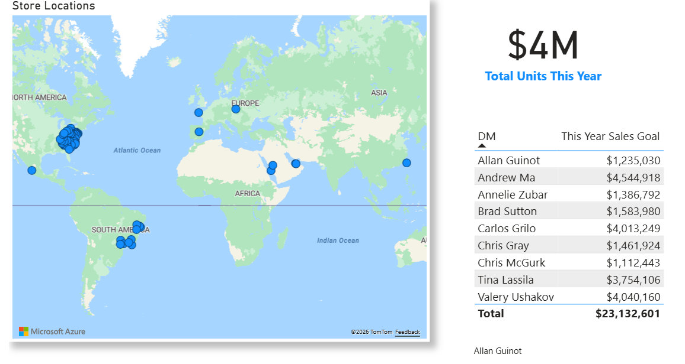
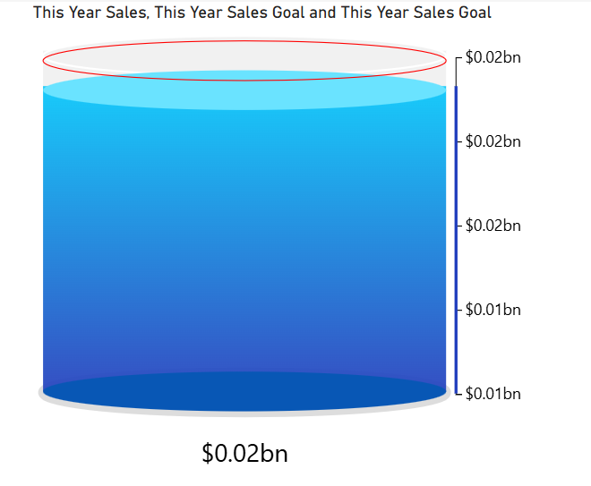
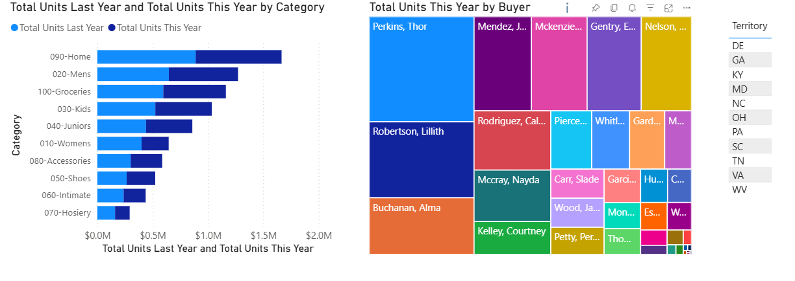
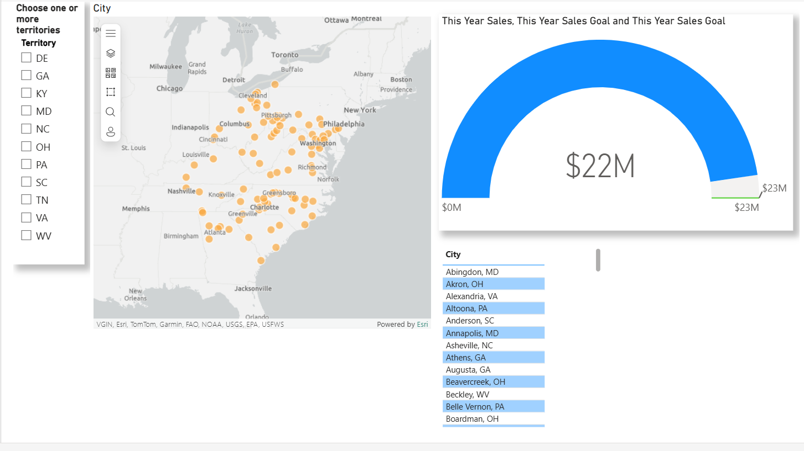

# Retail Revenue Analysis 

**Objectives:** \
Analyze stores revenue by region. \
Review District Managers sales against KPI.

**Tools**:
* Power BI for ETL and dashboard implementation: [Power BI dashboard](https://app.powerbi.com/links/M3LybOsB0T?ctid=f785a479-e94e-46ae-89e7-b1205975634f&pbi_source=linkShare)

**Analysis Overview** \

**Goal tracking**\

**Sales by category tracking**\

**Sales by territory**\
